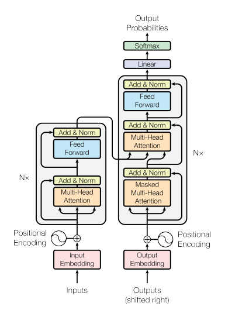
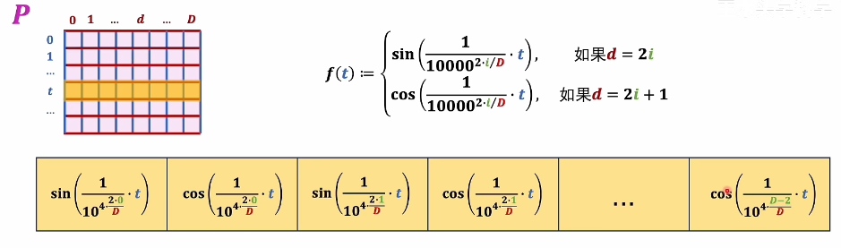
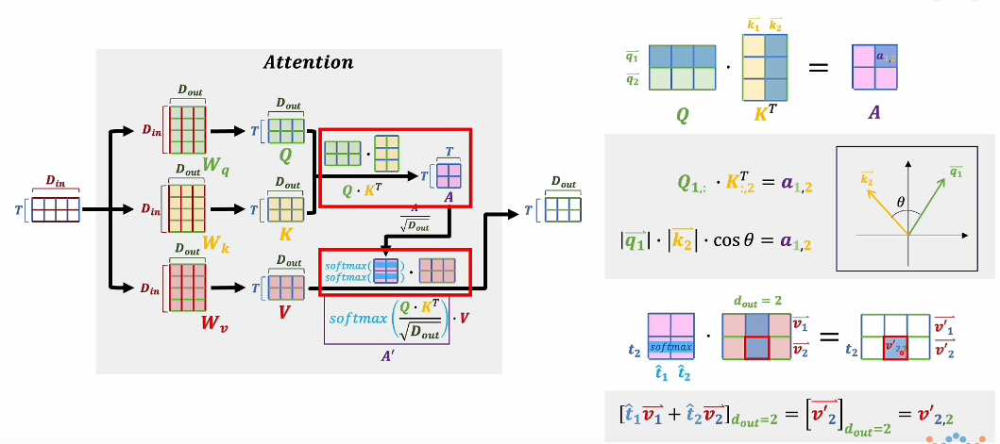

# Transformer学习笔记

本仓库为Transformer学习笔记，实现了Transformer并用一个copy任务测试

项目结构

```
.
├── decoder
│   ├── decoder_layer.py                   解码器层              
│   ├── decoder.py                         解码器
│   ├── output.py                          输出部分
├── embedding
│   ├── embedding.py                       词向量嵌入
│   ├── position_encoding.py               位置编码
├── encoder
│   ├── attention.py                       注意力机制
│   ├── encoder_layer.py                   编码器层
│   ├── encoder.py                         编码器
│   ├── layer_norm.py                      规范化层
│   ├── mask.py                            掩码张量
│   ├── positionwise_feed_forward.py       前馈全连接层
│   └── sublayer_connection.py             子层连接结构
├── main.py                                程序入口
├── README.md
└── transformer.py                         构建模型
```

## 1.环境搭建

```shell
conda create -n transformer python=3.10
conda activate transformer
pip3 install torch torchvision torchaudio --index-url https://download.pytorch.org/whl/cu118
pip3 install pyitcast
```

## 2.学习笔记



### 2.1 单词Embedding

通过Word2Vec、Glove 等算法获取单词Embedding

### 2.2位置编码



Transformer 中单词的输入表示x由单词 Embedding 和位置 Embedding （Positional Encoding）相加得到。

### 2.3自注意力机制



Q和K的转置相乘表示的是词向量之间的关系，值越大表示其相关程度越大

归一化之后与V相乘进行修正

选择两个矩阵相乘，是为了给注意力机制添加非线性因素

Decoder中第二个自注意力输入的K、V是由Encoder输出计算得来的

### 2.4Add & Norm

Add（參差连接）：将子层（例如自注意力或前馈网络）的输出与其输入相加。目的是缓解梯度消失问题。

Norm（归一化）：将Add的结果进行归一化处理

### 2.5Feed Forward层

FFN包含两个线性变换（全连接层），第一层将输入维度映射到一个更高的维度，第二层将高维向量映射回原来的维度。 $$ FFN(x)=ReLU(xW_1+b_1)W_2+b_2 $$ ReLU为激活函数
